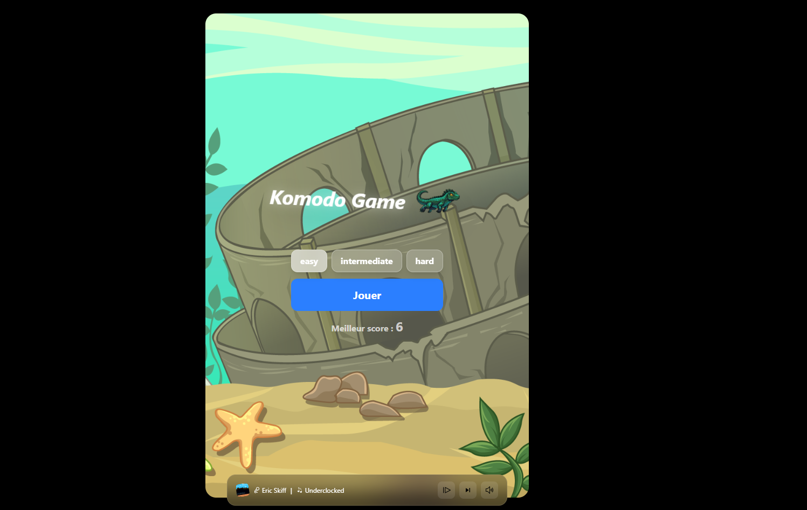
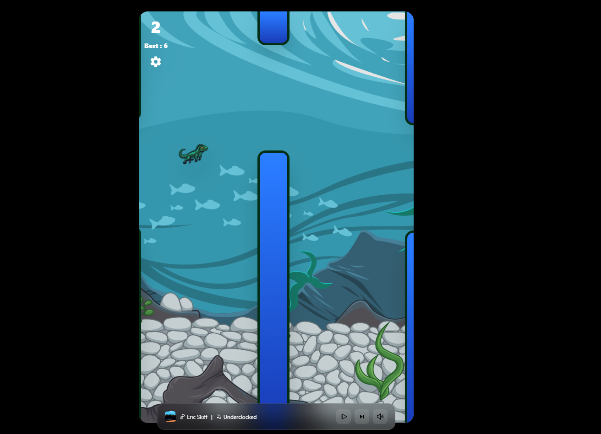
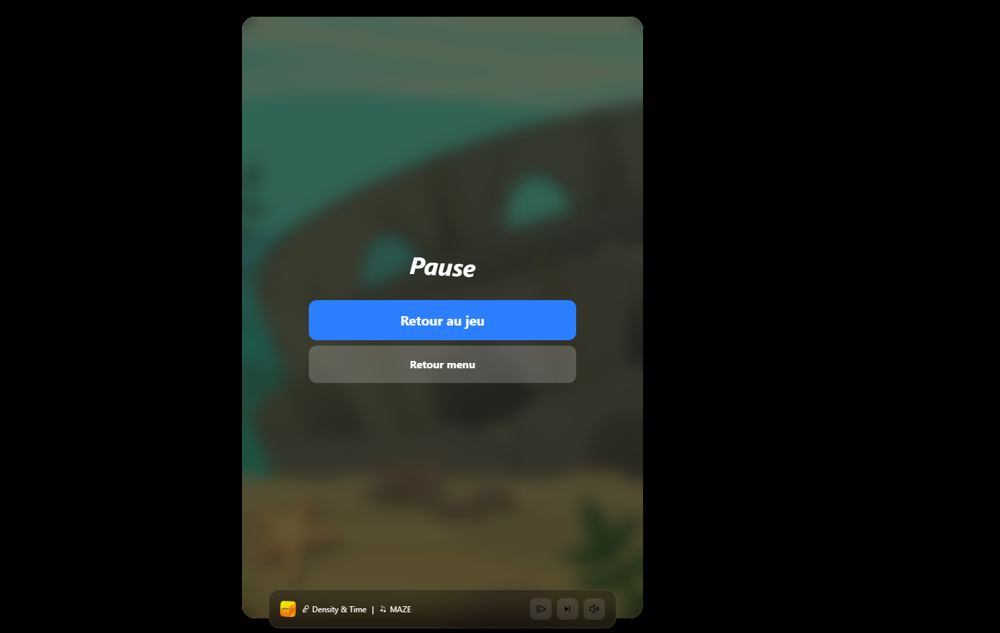
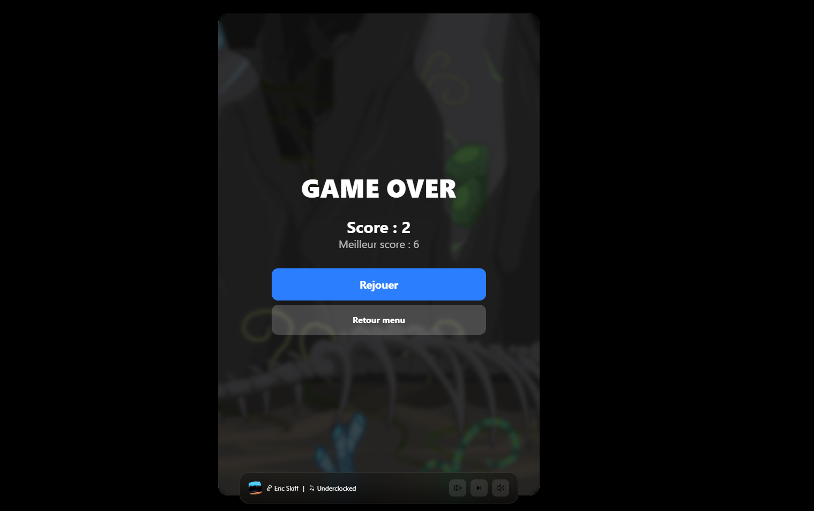

# 🦎 Komodo Game

Komodo Game est un mini jeu arcade inspiré du gameplay de **Flappy Bird**, développé avec **Next.js**, **TypeScript**, **TailwindCSS** et **Framer Motion**.

Le joueur contrôle un petit dragon de Komodo qui doit éviter des obstacles générés dynamiquement tout en augmentant son score.

---

## ✨ Fonctionnalités

* 🎮 Gameplay fluide type Flappy Bird
* ⚡ Difficultés dynamiques

  * Easy
  * Intermediate
  * Hard
* 🏆 Sauvegarde des meilleurs scores avec `localStorage`
* 🎵 Musiques aléatoires intégrées
* 🔇 Système de mute
* ⏭️ Skip de musique
* ⏸️ Pause du jeu
* 💥 Détection de collisions
* 🌈 Animations avec Framer Motion
* 📱 Interface responsive et moderne

---

## 🛠️ Stack Technique

* **Next.js 16**
* **TypeScript**
* **TailwindCSS**
* **Framer Motion**
* **React Icons**

---

## 🚀 Installation

Clone le projet :

```bash
git clone https://github.com/WayeNot/komodogame.git
```

Entre dans le dossier :

```bash
cd komodogame
```

Installe les dépendances :

```bash
npm install
```

Lance le serveur de développement :

```bash
npm run dev
```

Puis ouvre :

```txt
http://localhost:3000
```

---

## 🎮 Contrôles

| Action          | Touche             |
| --------------- | ------------------ |
| Voler           | `SPACE` ou `CLICK` |
| Pause           | Bouton paramètres  |
| Mute musique    | Bouton mute        |
| Changer musique | Bouton skip        |

---

## 🧠 Système de difficulté

Le jeu adapte automatiquement :

* la vitesse des obstacles
* leur espacement
* la difficulté globale

---

## 💾 Sauvegarde des scores

Les meilleurs scores sont stockés dans le navigateur avec :

```txt
easy_best_score
intermediate_best_score
hard_best_score
```

---

## 📸 Aperçu

```md





```

---

## 📜 Licence

Projet open-source sous licence MIT.

---

## ❤️ Auteur

Développé avec passion par **Ewen & Aymeric**.